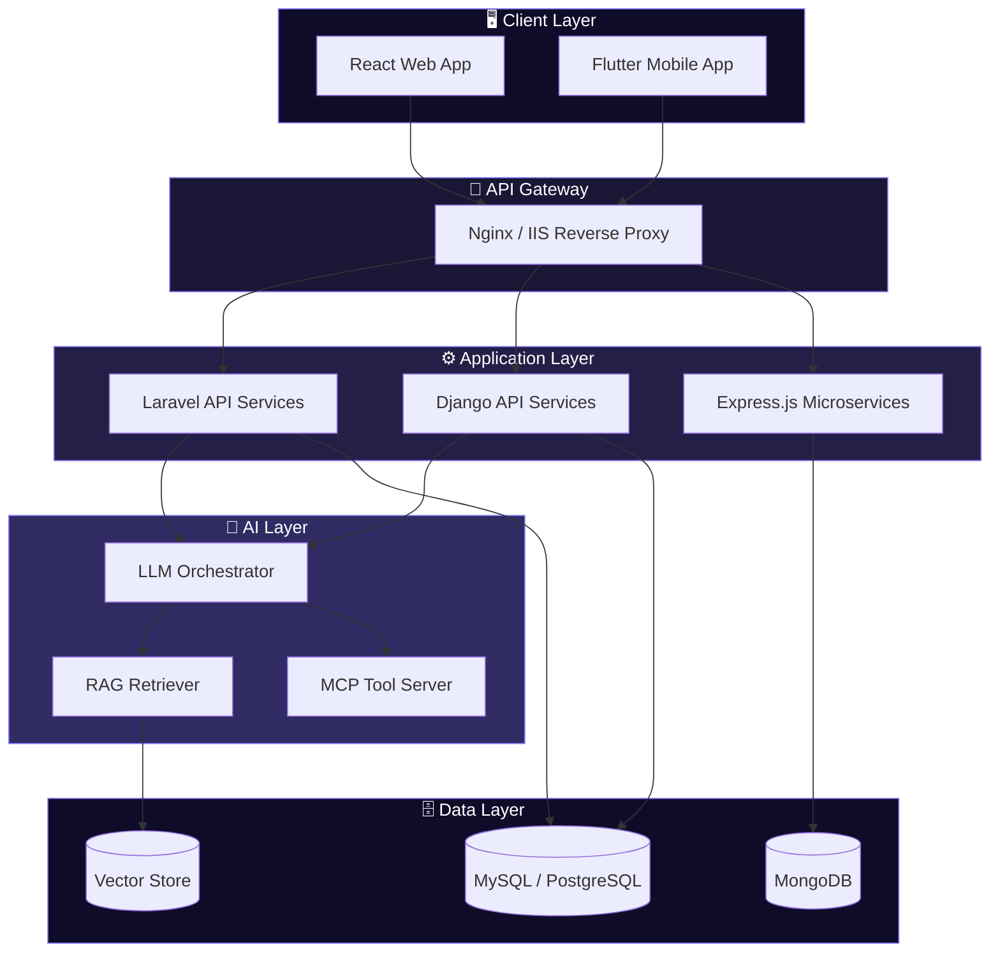
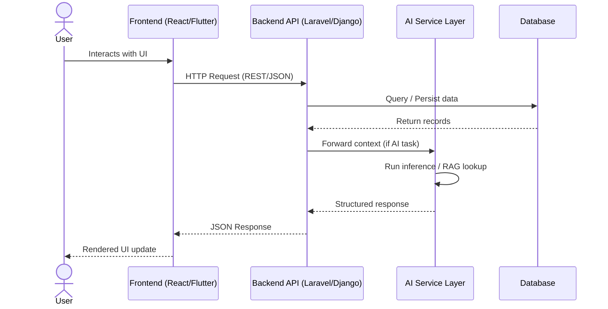
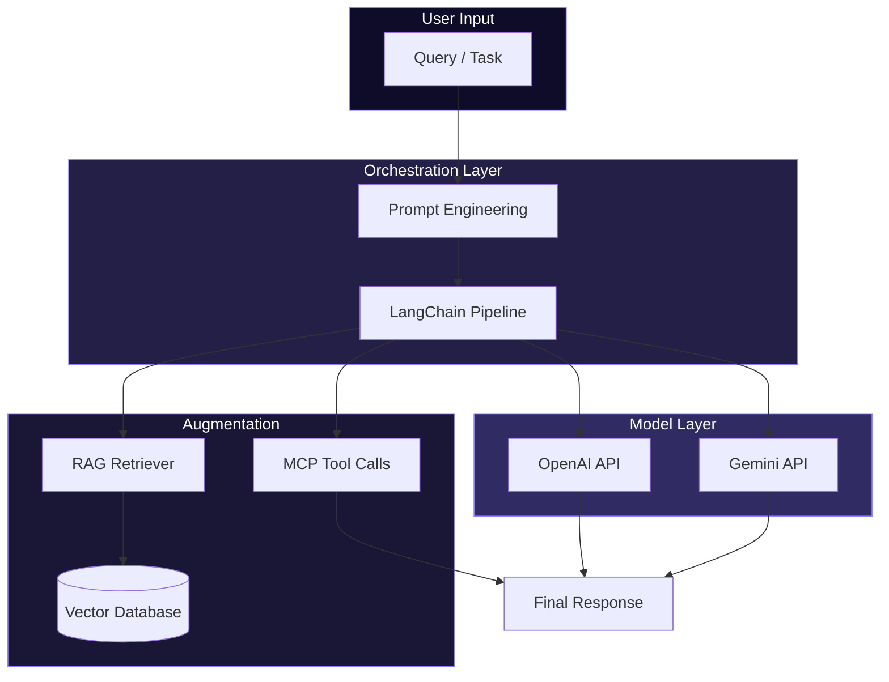
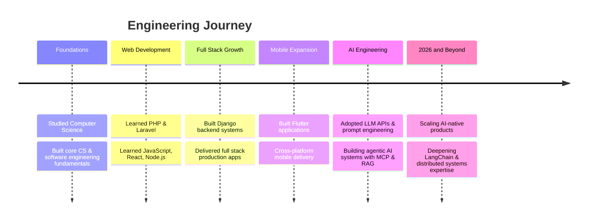

<div align="center">


<br/>

<a href="https://git.io/typing-svg">
  
</a>

<br/><br/>


<br/><br/>


</div>

<br/>


## 🧭 About Me

<table>
<tr>
<td width="60%" valign="top">

I'm **Rohullah Amin Sarwari**, a Full Stack Software Engineer and AI Engineer based in **Kabul, Afghanistan**, holding a **Bachelor's degree in Computer Science (Software Engineering)**.

I design and build production-grade systems end-to-end — from relational data models and backend APIs to polished frontend interfaces and, increasingly, AI-powered agents woven directly into real products. My engineering background spans **Laravel and Django** on the backend, **React and Flutter** across web and mobile, and a growing specialization in **LLM applications, prompt engineering, and agentic AI systems**.

I care about software that is **maintainable, well-architected, and genuinely useful** — not just functional. Whether it's a hospital prescription platform, a university management information system, or an AI assistant, I approach every project with the same standard: clean architecture, thoughtful UX, and code that a team can build on for years.

</td>
<td width="40%" valign="top">

```yaml
engineer:
  name: "Rohullah Amin Sarwari"
  role:
    - "Full Stack Software Engineer"
    - "AI Engineer"
    - "Backend Developer"
  location: "Kabul, Afghanistan"
  education: "B.Sc. Computer Science"
  languages:
    human: ["Pashto", "Dari", "English"]
    code: ["PHP", "Python", "JS/TS", "C++", "C#"]
  currently_building:
    - "AI-powered assistants"
    - "Full stack web platforms"
  status: "shipping code, training models"
```

</td>
</tr>
</table>

<br/>

## 🎯 Current Focus

<table>
<tr>
<td width="25%" align="center">🏗️</td>
<td><b>Architecting</b> a full-featured University Management Information System (MIS) with role-based workflows and reporting</td>
</tr>
<tr>
<td align="center">🤖</td>
<td><b>Engineering</b> AI agents and assistants using LLM APIs, RAG pipelines, and the Model Context Protocol (MCP)</td>
</tr>
<tr>
<td align="center">📱</td>
<td><b>Shipping</b> cross-platform mobile experiences with Flutter and React Native</td>
</tr>
<tr>
<td align="center">📚</td>
<td><b>Deepening</b> expertise in LangChain, vector databases, and production-grade RAG architecture</td>
</tr>
</table>

<br/>

## 🧠 AI Engineering

<div align="center">


</div>

I build with large language models as core application infrastructure — not just as chat wrappers. My AI work centers on:

- **Agentic systems** — task-oriented AI agents that plan, call tools, and complete multi-step workflows
- **RAG pipelines** — retrieval-augmented generation over private/domain-specific knowledge bases
- **MCP integrations** — connecting LLMs to real tools, databases, and external services via the Model Context Protocol
- **Prompt engineering** — structured, reliable prompting for production use cases, not just demos
- **LangChain** *(actively learning)* — orchestration layers for multi-step LLM applications

<br/>


## 🛠️ Tech Stack

### Languages

<div align="center">


</div>

### Frontend

<div align="center">


</div>

### Backend

<div align="center">


</div>

### Mobile

<div align="center">


</div>

### Databases

<div align="center">


</div>

### Cloud & DevOps

<div align="center">


</div>

### Tools

<div align="center">


</div>

<br/>

<div align="center">

</div>

<br/>


## 🏗️ System Architecture



## 🔄 Request Flow



## 🧬 Full Stack Development Workflow

```mermaid
flowchart LR
    A[Requirements & Planning] --> B[System Design]
    B --> C[Database Modeling]
    C --> D[Backend Development]
    D --> E[Frontend Development]
    E --> F[AI Feature Integration]
    F --> G[Testing & QA]
    G --> H[Deployment]
    H --> I[Monitoring & Iteration]
    I -.->|Feedback Loop| A

    style A fill:#0f0c29,stroke:#8A7FFF,color:#fff
    style B fill:#181433,stroke:#8A7FFF,color:#fff
    style C fill:#211c3d,stroke:#8A7FFF,color:#fff
    style D fill:#2a2447,stroke:#8A7FFF,color:#fff
    style E fill:#332c52,stroke:#8A7FFF,color:#fff
    style F fill:#3c355c,stroke:#8A7FFF,color:#fff
    style G fill:#453d66,stroke:#8A7FFF,color:#fff
    style H fill:#4e4671,stroke:#8A7FFF,color:#fff
    style I fill:#574e7b,stroke:#8A7FFF,color:#fff
```



## 🤖 AI Stack Architecture



## 📈 Development Lifecycle

```mermaid
gantt
    dateFormat  X
    axisFormat %s
    section Discovery
    Requirements Gathering      :done, 0, 1
    Architecture Design         :done, 1, 2
    section Build
    Backend & Database          :active, 2, 4
    Frontend Implementation     :3, 5
    AI Integration              :4, 6
    section Ship
    Testing & QA                :6, 7
    Deployment                  :7, 8
    Monitoring                  :8, 9
```



<br/>


## 📊 GitHub Analytics

<div align="center">


<br/>


</div>

<div align="center">

### 🏆 GitHub Trophies


</div>

<div align="center">

### 📅 Contribution Graph


</div>

<div align="center">

### 🐍 Contribution Snake


<sub>Generated via the <code>Platane/snk</code> GitHub Action — add the workflow to your profile repo to activate.</sub>

</div>

<div align="center">

### ⚡ GitHub Metrics


</div>

<br/>

### 🎖️ External Platform Stats

<div align="center">


<sub>Connect these accounts and swap in your real handles to activate live badges.</sub>

</div>

<br/>


## 🚀 Featured Projects

<table width="100%">
<tr>
<td width="50%" valign="top">

### 🎓 University MIS
**Management Information System**

A complete, full-stack Management Information System for university operations — handling student records, academic administration, and institutional reporting through role-based dashboards.

`Laravel` `MySQL` `React` `REST API`

</td>
<td width="50%" valign="top">

### 💊 Doctor Online Prescription System
**Digital Healthcare Platform**

A digital prescription platform connecting doctors and patients, streamlining prescription issuance, tracking, and secure record-keeping in a clinical workflow.

`Django` `PostgreSQL` `React` `Auth & Security`

</td>
</tr>
<tr>
<td width="50%" valign="top">

### 🤖 AI Assistant
**LLM-Powered Agent System**

An AI assistant built on modern LLM APIs with tool-calling, context retrieval, and agentic task execution — designed as a reusable foundation for AI-driven products.

`OpenAI API` `RAG` `MCP` `Prompt Engineering`

</td>
<td width="50%" valign="top">

### 📱 Flutter Applications
**Cross-Platform Mobile Suite**

A collection of cross-platform mobile applications built with Flutter, sharing a single codebase across Android and iOS with native-feeling performance.

`Flutter` `Dart` `REST API` `Firebase`

</td>
</tr>
<tr>
<td width="50%" valign="top">

### 🌐 Full Stack Web Applications
**End-to-End Product Builds**

Multiple end-to-end web applications spanning e-commerce, management systems, and internal tools — covering everything from schema design to deployment.

`Laravel` `Django` `React` `Node.js`

</td>
<td width="50%" valign="top">

### 🧵 Carpet Management System
**Business + E-Commerce Platform**

A business management platform for the carpet trade, paired with a customer-facing website and integrated online payment processing.

`Full Stack` `Payments` `E-Commerce`

</td>
</tr>
</table>

<br/>


## 🗓️ Timeline



## 🧭 2026 Learning Roadmap

```mermaid
flowchart LR
    A[LangChain Mastery] --> B[Vector Databases]
    B --> C[Advanced RAG Pipelines]
    C --> D[Multi-Agent Systems]
    D --> E[Cloud-Native Deployment]
    E --> F[System Design at Scale]
    F --> G[Open Source Contributions]

    style A fill:#0f0c29,stroke:#8A7FFF,color:#fff
    style B fill:#1a1636,stroke:#8A7FFF,color:#fff
    style C fill:#241f47,stroke:#8A7FFF,color:#fff
    style D fill:#2e2851,stroke:#8A7FFF,color:#fff
    style E fill:#38315b,stroke:#8A7FFF,color:#fff
    style F fill:#423a65,stroke:#8A7FFF,color:#fff
    style G fill:#4c436f,stroke:#8A7FFF,color:#fff
```



- [ ] Achieve production fluency in **LangChain** and agent orchestration frameworks
- [ ] Design and ship a **multi-agent AI system** with tool-use and memory
- [ ] Deepen **vector database** and semantic search expertise (pgvector, Pinecone, Qdrant)
- [ ] Build and deploy on **cloud-native infrastructure** (containers, CI/CD, orchestration)
- [ ] Contribute meaningfully to **open source AI tooling**
- [ ] Formalize **system design** skills for large-scale distributed applications

<br/>


## 🎯 Career Goals

<table>
<tr>
<td width="33%" align="center" valign="top">

**🏢 Short Term**

Ship high-impact full stack and AI-integrated products in a senior engineering role, deepening architecture and system design skills.

</td>
<td width="33%" align="center" valign="top">

**🚀 Mid Term**

Specialize deeply in AI engineering — building and leading the development of production-grade agentic and RAG systems.

</td>
<td width="33%" align="center" valign="top">

**🌍 Long Term</b>**

Lead engineering teams building AI-native software products, while mentoring the next generation of developers in Afghanistan and beyond.

</td>
</tr>
</table>

## 🌱 Open Source Goals

- Publish reusable Laravel and Django starter kits for AI-integrated web apps
- Contribute to open-source RAG and MCP tooling projects
- Release a well-documented Flutter component library
- Maintain at least one actively-used public repository with community contributions

<br/>


## 💭 Development Philosophy

> **Build it right, not just fast.**
> Clean architecture and readable code are not luxuries — they are what let a product survive contact with real users and real scale.

I believe in:

- **Simplicity over cleverness** — the best code is code the next engineer can understand in five minutes
- **Data models first** — a well-designed schema prevents ninety percent of future pain
- **AI as a tool, not a gimmick** — every AI feature must solve a real problem, not just exist for the demo
- **Documentation as a first-class deliverable** — undocumented code is unfinished code

<br/>

<div align="center">

### 💬 Favorite Quote

> *"Simplicity is the ultimate sophistication."*
> — Leonardo da Vinci

</div>

<br/>

## ⚡ Fun Facts

- 🌍 I build software in three human languages — **Pashto, Dari, and English**
- 🧵 Alongside software, I've explored building a **carpet management platform** with online payments
- 📈 I occasionally read **trading charts** for gold and forex markets in my downtime
- ⌨️ I've written full stack apps across **five+ frameworks** — Laravel, Django, Express, React, and Flutter
- 🧠 My current obsession is making **AI agents that actually finish tasks**, not just talk about them

<br/>


## 📬 Let's Connect

<div align="center">

<a href="https://linkedin.com/in/rohullah-sarwari" target="_blank">
  
</a>
<a href="mailto:rohullah.sarwari@gmail.com">
  
</a>
<a href="https://github.com/rohullah-sarwari" target="_blank">
  
</a>

<br/><br/>

<sub>📍 Kabul, Afghanistan &nbsp;•&nbsp; Open to full stack & AI engineering opportunities</sub>

</div>

<br/>


<div align="center">
<sub>Designed & engineered by Rohullah Amin Sarwari — thanks for reading this far. ⭐ Star a repo if you found something useful.</sub>
</div>
